# My SQL 과 Node.js를 활용한 온라인 쇼핑몰 제작

## 개요
My SQL을 활용하여 데이터베이스를 운용, Node.js를 활용한 모의 온라인 서비스를 시도해 보았습니다. 

## 주요기능
- 로그인
- 회원가입
- 장바구니
- 주문
- 평가
- QnA

| 하드웨어 환경 | 소프트웨어 환경 |
| --- | --- |
| CPU : Ryzen 5 5700X   GPU : NVIDIA GeForce 2060 8GB  8Gbps(Memory Speed), Compute Capability 6.1   Memory : 16GB, 2133MHz  저장장치 : HDD | My SQL ver 8.0    Node.js ver 21    |

## ER 다이어그램
 

Diagram - ER
 
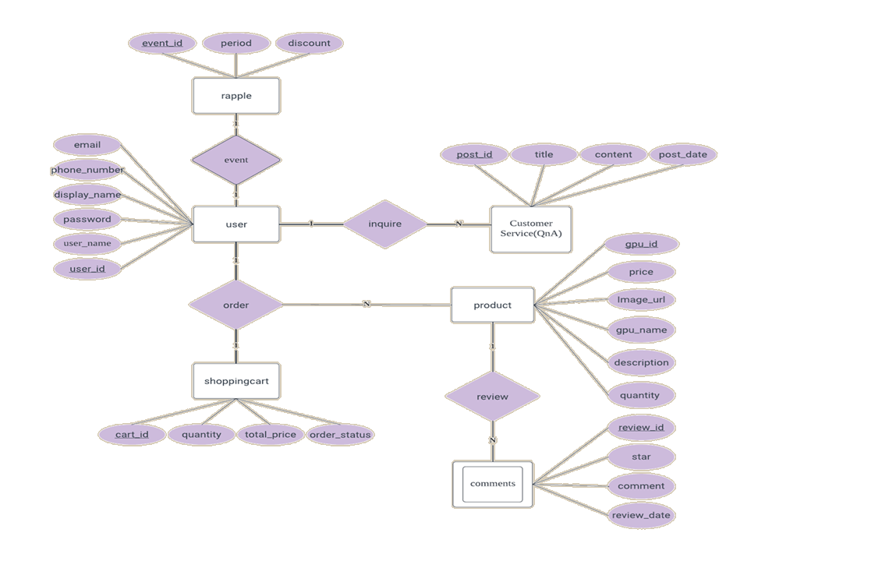
  
  
Diagram - EDR
 
  

## 데이터 크롤링
모의 사이트이기 때문에 실제로 판매되어 지고 있는 사이트의 상품의 데이터를 크롤링 하여 데이터베이스에 삽입하였습니다.
 

<테이블 1. 크롤링 데이터>

 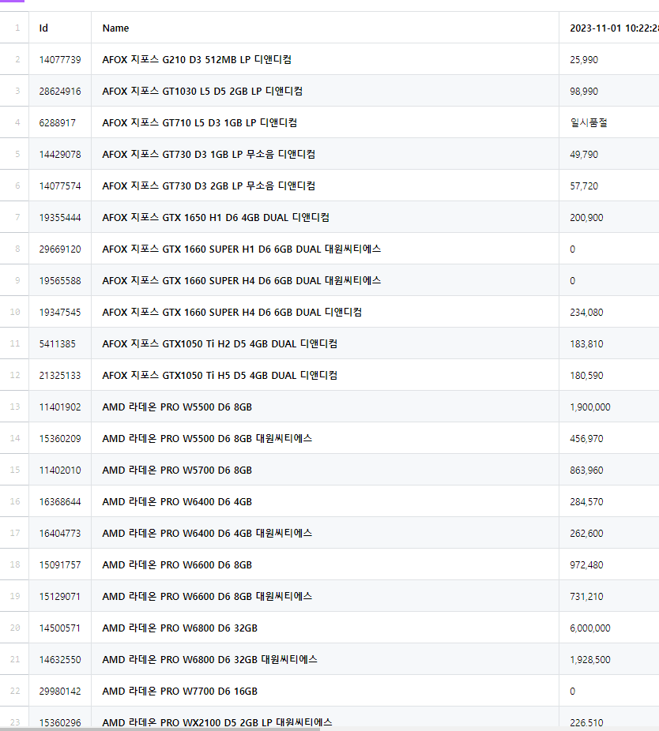

 

<테이블 2. SQL 데이터>

 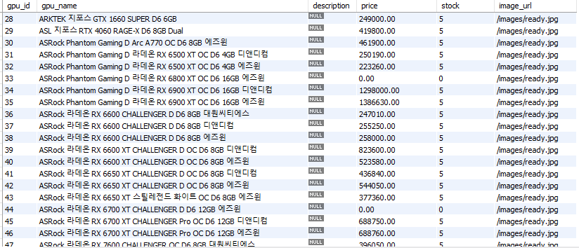

 

## SQL 데이터
 

<개인 로그인 데이터 >

 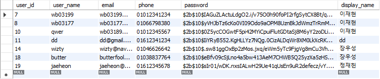
  
  

<QnA 기능 데이터>

 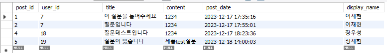
 
 

<상품 데이터>

 

 

<추첨 데이터>

 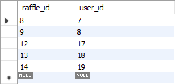

 

<리뷰 데이터>

 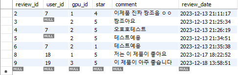
  
 

<장바구니 데이터>

 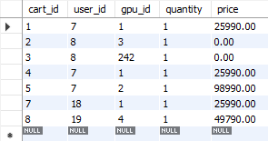

 

<몬스터 탄막 패턴>

## 스크린샷 및 상세 설명

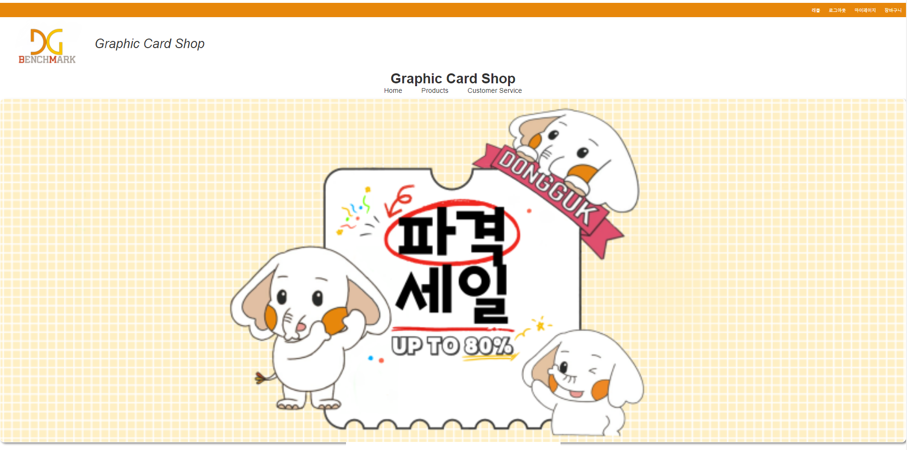

메인화면입니다.

스크롤을 내리면 해당 화면이 보입니다. 무작위로 보여줍니다.

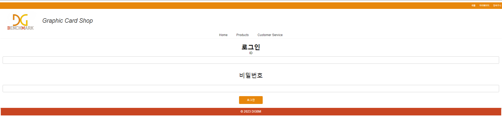

로그인 화면입니다.

회원가입 화면입니다.

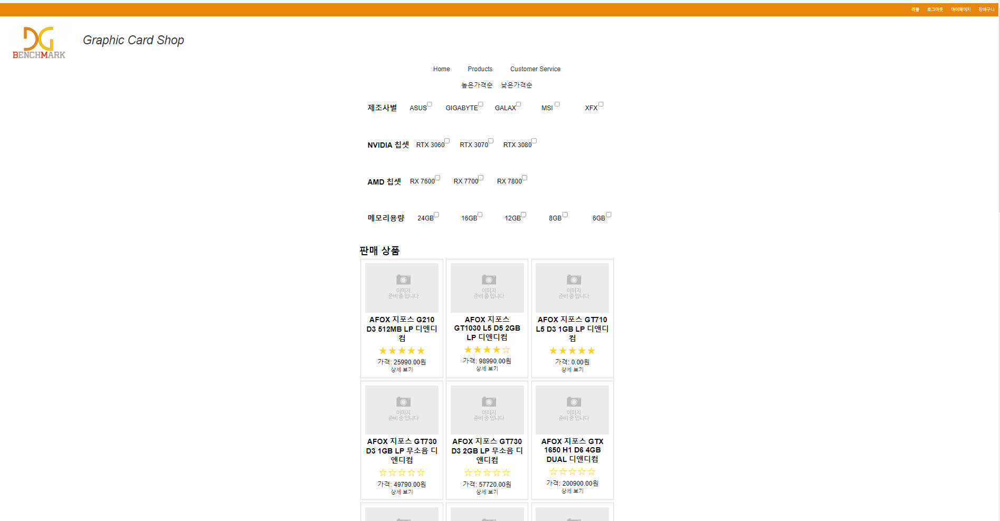

전체 상품 목록 페이지 입니다. 원하는 기준으로 정렬이 가능합니다.

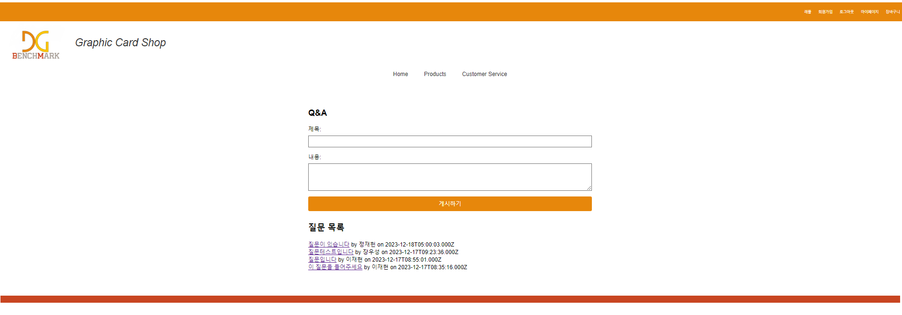

QnA 페이지 입니다. 다른 사람이 질문한 내역도 확인이 가능합니다.

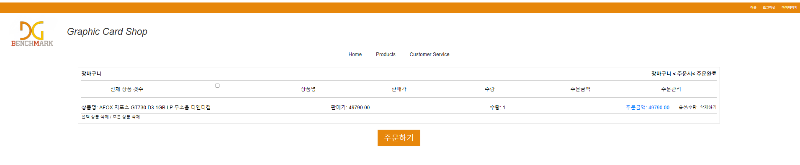

장바구니 페이지 입니다.

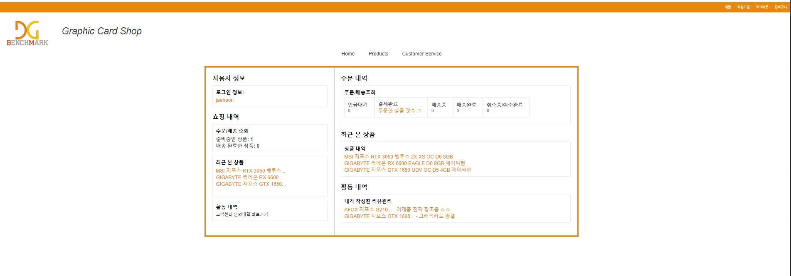

결제 후 주문 내역입니다.

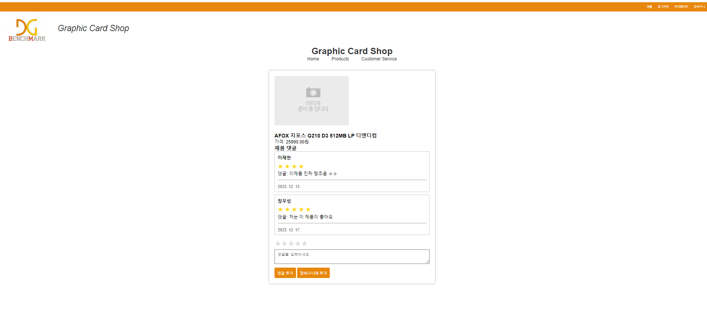

상품의 평가를 내릴 수 있는 페이지 입니다.
